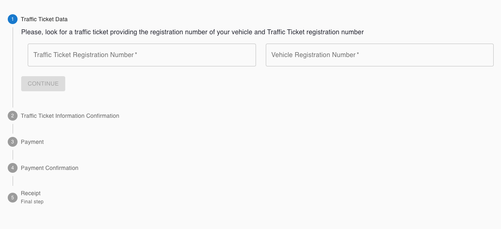
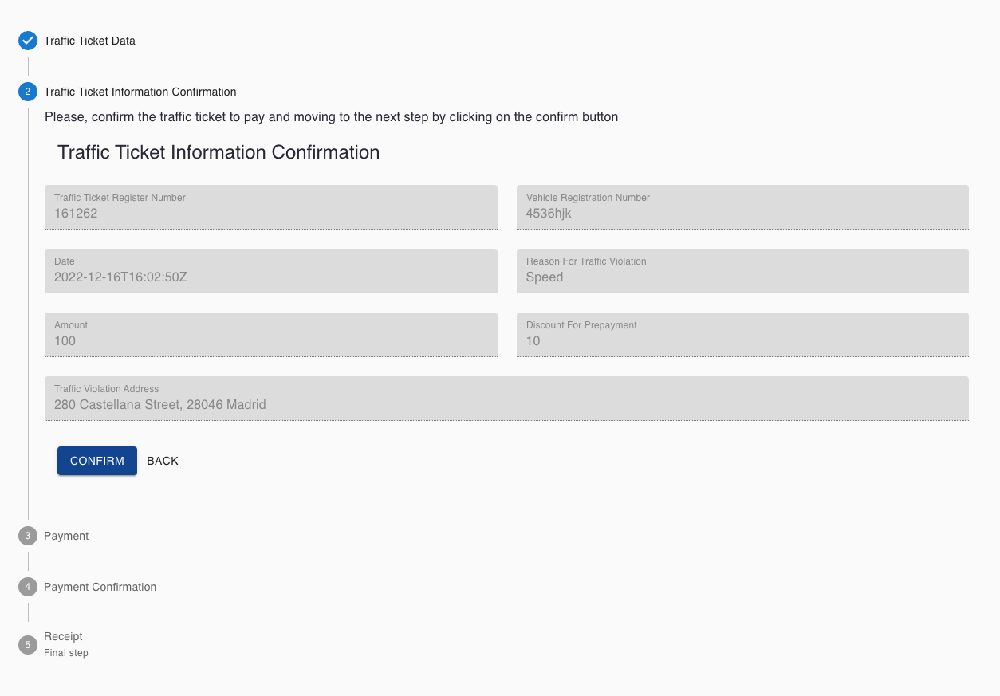
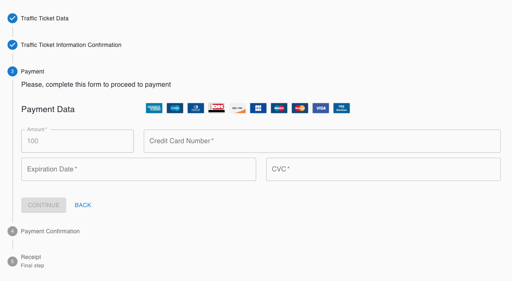
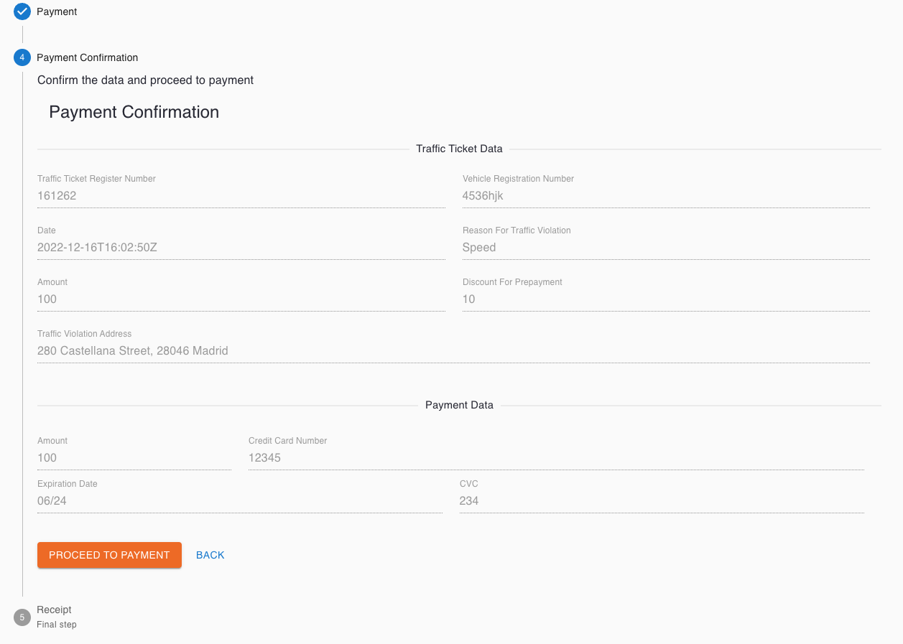
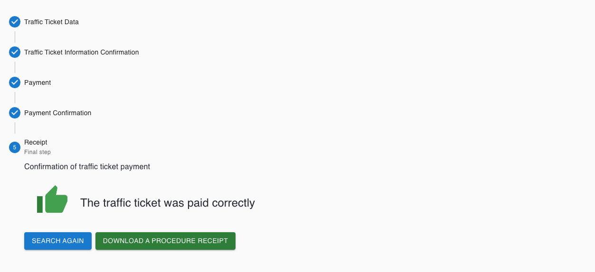

# React Traffic Ticket Collector

This application provides/simulate the capability to pay a traffic ticket based on data completed for a user agent. Data is recovered from Objects (bjects are OOTB no-code/low-code capabilities of Liferay).

Example of a multi-step react component that leverages getting and posting Liferay Object but could be interesting to integrate with another third-party data source. This component also contains translated content for Spanish, and English based on the user's Liferay language settings.

---

*Fill out the form with a Traffic Ticket Registration Number (ID Object Register) and Vehicle Registration Number*

<p align="center">
  
</p>

---

*Confirm the traffic ticket to pay by clicking on the confirm button*
<p align="center">
  
</p>

---

*Complete the payment data and continue*

<p align="center">
  
</p>

---

*Confirm the data and proceed to payment*

<p align="center">
  
</p>

---

*If payment is correct, application will provide a PDF procedure receipt to the user*

<p align="center">
  
</p>

---
<br/>

## Expected Use & Previous Steps
This resource can be used as a 7.4 Remote App (Custom Element) or a Client Extension service for LXC and you need to follow the next steps:
<br/>

### 1. Create the required Lifeary Objects

* Create Object named 'Traffic Ticket':

    - [x] Import Object going to Control Panel (Bento Menu) > Objects > Import (Kebab Menu)
    - [x] Import file:
        Name: TrafficTicket
        File: [Object_TrafficTicket.json](./init/Object_TrafficTicket.json)
    - [x] Publish Object.
    - [x] Import data:
        Go to your Liferay API Explorer: `[YOUR_DOMAIN]/o/api?endpoint=[YOUR_DOMAIN]/o/c/traffictickets/openapi.json`
            Look for the POST /batch API of `traffictickets`.
            Copy the content of [import-data-object-TrafficTicket.json](./init/import-data-object-TrafficTicket.json) into the Request body (application/json).
            Press 'execute' button.

<br/>

### 2. Clone Repo and Install Packages

Some adjusment have to be done before the application works:
* Clone or download the repo.
* Run the following:
```
npm run build
npm start
```
<br/>

## Display Method Options

The Traffic Ticket Collector can be added to your Liferay Platform using Remote Apps:

* Decide how are you going to deploy the App:

    * [Option 1] Adding JS and CSS to the Document Library. For example http://localhost:3000/static/js/bundle.js in your localhost.
    * [Option 2] Hosted on Remote Server (Make sure to set the CORs Policy to support this approach if on a separate domain).
    * [Option 3] LXC Client Extension Service.
    * [Option 4] Hosted on Liferay Server in webapps.

* Create the Remote App as a Custom Element Application:

  * Go to Control Panel (Bento Menu) > Applications > Remote Apps > Add Cutom Element ('+' button)

  | Field               | Value                         |
  | :---                | :----                         |
  | HTML Element Name   | traffic-ticket-collector      |
  | urls                | path to main.js               |
  |                     | path to 498.4dbda710.chunk.js |
  | cssURLs             | path to main.css              |


